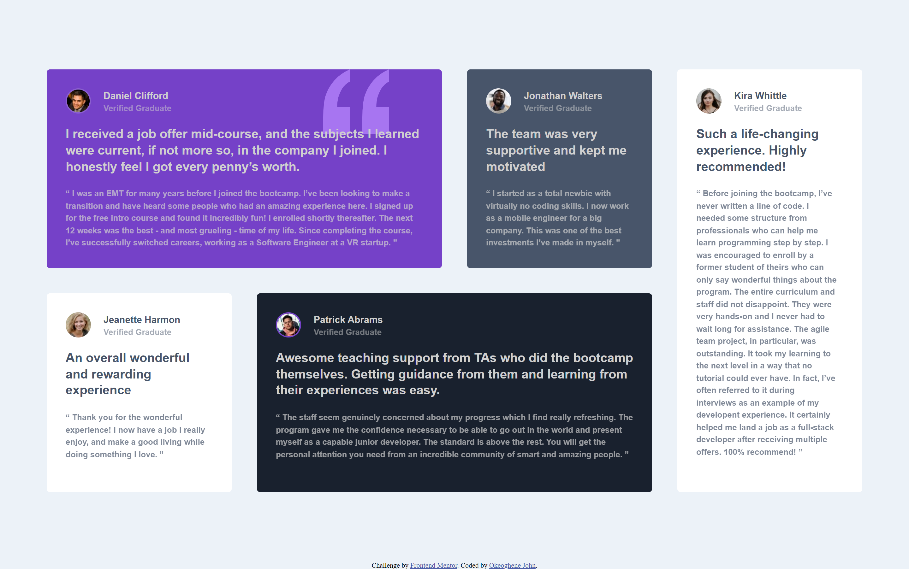

# Frontend Mentor - Testimonials grid section solution

This is a solution to the [Testimonials grid section challenge on Frontend Mentor](https://www.frontendmentor.io/challenges/testimonials-grid-section-Nnw6J7Un7). Frontend Mentor challenges help you improve your coding skills by building realistic projects. 

## Table of contents

- [Overview](#overview)
  - [The challenge](#the-challenge)
  - [Screenshot](#screenshot)
  - [Links](#links)
- [My process](#my-process)
  - [Built with](#built-with)
  - [What I learned](#what-i-learned)
  - [Continued development](#continued-development)
  - [Useful resources](#useful-resources)
- [Author](#author)


## Overview

### The challenge

Users should be able to:

- View the optimal layout for the site depending on their device's screen size

### Screenshot



### Links

- Solution URL: [Add solution URL here](https://your-solution-url.com)
- Live Site URL: [(https://alloyc.github.io/testimonial-grid-challenge/)]

## My process

### Built with

- Semantic HTML5 markup
- CSS custom properties
- Flexbox
- CSS Grid
 
### What I learned
 I learnt when to use grid abit more, expectially grid template columns and grid template rows.
 Using developers tool to analyse web page is also one of the major knowledge i gain during this challenge.
   

```css
main{
    display: grid;
    grid-template-columns: repeat(4, 1fr);
    grid-template-rows: repeat(2, 1fr);
}
.container{
    height: fit-content;
}  
```

### Continued development

The height of the svg image used as the background for the first content.  

### Useful resources

- (https://www.freecodecamp.com) - This helped me organise my learning process. I really liked this pattern and will use it going forward.

## Author

- Frontend Mentor - [@AlloyC](https://www.frontendmentor.io/profile/AlloyC)
